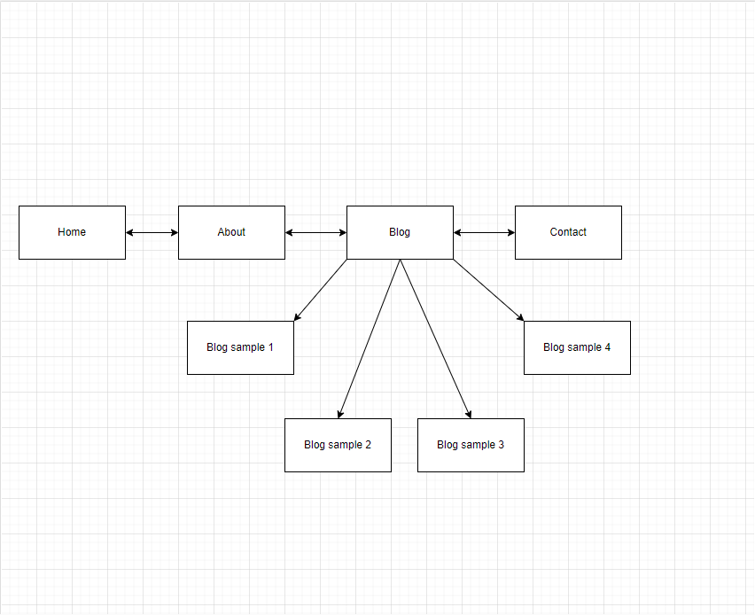

# T1A2-portfolio

<h1>Jessica Blackman Portfolio</h1>

<h2>Link to finished website: https://main--jblackman-portfolio.netlify.app/</h2>

<h2>Link to GitHub repository: https://github.com/jblac98/T1A2-portfolio</h2>

<h2>Portfolio Website:</h2>

<h3>Purpose</h3>

The purpose of this assessment is to demonstrate my ability and showcase my skills to prospective employers. I will accomplish this by creating a website that will show my coding ability.

<h3>Functionalty and features

The functionality and features used are structure tags, hypertext and links, forms and input, CSS, media integration, accessability, responsive design, lists and semantic elements.

<h3>R6 - Wireframes</h3>

I designed the background to have a linear gradient and have the purple flow from the left to the right, turning into pink and then white. I am aiming for a simple design, which meant I kept the same flow throughout the other pages. I played around with the colours of the headings, on the home page I chose white for the two headings to contrast this with the backgroud. I then Chose black for the rest of the pages to make it stand out and be readable. I kept the buttons a simple black with white writing as this fit the aesthetic of the page.  To keep the simple flow of things I added minimal images and one image on the about me page.

<h4>Home page wireframes</h4>

<h4>About page wireframes</h4>

<h4>Blog page wireframes</h4>

<h4>Blog page-sample post wireframe</h4>

<h4>Contact page wireframe</h4>

<h3>R5 - Sitemap</h3>

For the layout I kept the home page, about page, blog page and contact page all connected to eachother and easy to find in the side navigation bar. Only when you get to the blog page when you click on the "Read More" button it will take you to the blog samples and here you will find an image with a block of text and a title. This makes it easy to navigate through the different pages.

<h3>Target Audience</h3>

Target audience: Prospective employers

Expectations of knowledge in:
<ul>
    <li>Softwre development</li>
    <li>Coding</li>
    <li>Programming languages</li>
    <li>Development stacks</li>
    <li>Professionalism</li>
    <li>Positive work ethic</li>
</ul>

<h3>R7 - Tech Stack</h3>

<ul>
    <li>Linux operating system</li>
    <li>VS Code</li>
    <li>html</li>
    <li>CSS</li>
    <li>Jacvascript</li>
    <li>Netlify</li>
    <li>GitHub</li>
    <li>drawio</li>
    <li>Figma</li>
</ul>

<h4>Explanation</h4>

<li>The linux operating system and VS Code work hand in hand. It will help with creating the directory and and with VS Code I will use that to create my html files and CSS for styling</li>

<li>html will help me to structure the contents of the page</li>

<li>I use CSS to style the contents on the page</li>

<li>I have used Javascript to assit me in creating the sidebar</li>

<li>I use Netlify to deploy my website and get it running</li>

<li>I use GitHub to store the contents of my website on this platform. I also link this to Netlify to assist in deploying my website.</li>

<li>I used drawio to create my sitemap and this links into VS Code which is handy, this shows how you can navigate through my pages. </li>

<li>Laslty, I use Figma to map out my designs for when I create this content in VS Code.</li>

<li>All these components and tools are used to engage the audience when experiencing my website.</li>

<h2>References</h2>

<li>HTML & CSS - how to split a background into 2 colors (2021) YouTube. Available at: https://www.youtube.com/watch?v=XIfEWsF2T5A (Accessed: 02 June 2024).</li>

<li>How to - rounded images (no date) How To Create Rounded Images. Available at: https://www.w3schools.com/howto/howto_css_rounded_images.asp (Accessed: 02 June 2024).</li>

<li>(No date) HTML symbols. Available at: https://www.w3schools.com/html/html_symbols.asp (Accessed: 02 June 2024).</li>

<li>Coder Academy (2024) How to create a footer Avilable at: https://ait.instructure.com/courses/5351/pages/conference-recordings-term-1 (Accessed: 02 June 2024)</li>

<li>Coder Academy (2024) How to create blog posts Avilable at: https://ait.instructure.com/courses/5351/pages/conference-recordings-term-1 (Accessed: 02 June 2024)</li>

<li>How to - collapse sidebar (no date) How To Create a Collapsed Sidebar. Available at: https://www.w3schools.com/howto/howto_js_collapse_sidebar.asp (Accessed: 02 June 2024).</li> 

<li>GeeksforGeeks (2023) How to trigger a file download when clicking an HTML button or JavaScript?, GeeksforGeeks. Available at: https://www.geeksforgeeks.org/how-to-trigger-a-file-download-when-clicking-an-html-button-or-javascript/ (Accessed: 02 June 2024).</li> 

<li>Build a responsive sidebar menu in HTML, CSS, & javascript - beginner (2023) YouTube. Available at: https://www.youtube.com/watch?v=uy1tgKOnPB0 (Accessed: 02 June 2024).</li>

<li>How to - contact form (no date) How To Create a Contact Form with CSS. Available at: https://www.w3schools.com/howto/howto_css_contact_form.asp (Accessed: 02 June 2024).</li> 